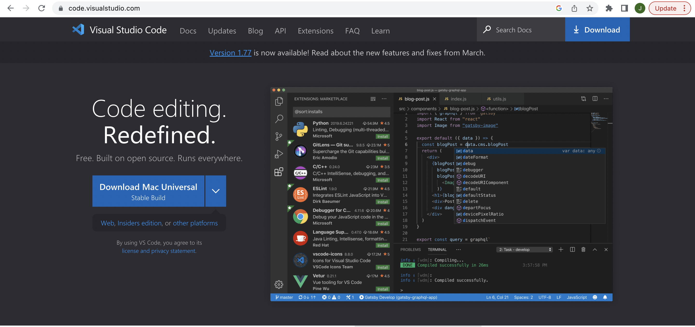

# Lab Report 1
Welcome incoming CSE 15l students!

Today we're going to walk through:
1. How to get your system set up on Visual Studio Code
2. Setting up your client to connect remotely using ssh to an @ieng6 server
3. Trying different key commands out to access the different paths and working directories on the remote server

Assuming you already have java installed onto your computer, your first course of action will be to download VS code onto the system. 
To do this you will have to visit the following link:[https://code.visualstudio.com/](https://code.visualstudio.com/)

Once you've downloaded VS code onto your computer, open a new file and continue to the extensions tab where you will download the java extension
onto your system. The extensions tab looks like this: 
