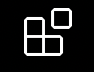
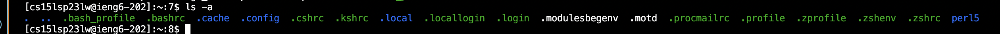

# Lab Report 1
Welcome incoming CSE 15l students!

Today we're going to walk through:
1. How to get your system set up on Visual Studio Code
2. Setting up your client to connect remotely using ssh to an @ieng6 server
3. Trying different key commands out to access the different paths and working directories on the remote server

Your first course of action will be to download VS code onto the system. 
To do this you will have to visit the following link:[https://code.visualstudio.com/](https://code.visualstudio.com/)

Once you've downloaded VS code onto your computer, open a new file and continue to the extensions tab where you will download the java extension
onto your system. The extensions tab looks like this: 

Congratulations! You've completed the first step, and now have VS code installed onto your system!

The next step is to access your terminal *within VS code*, in order to do this you will need to go to **View** on the upper toolbar of your mac and
scroll down to **Terminal**

Once you've accessed the terminal you will enter the command: "ssh cs15lsp23**XX**@ieng6.ucsd.edu" where the "**XX**" is replaced by the two letters
on your course specific account username. Your course specific account username can be found [here](https://sdacs.ucsd.edu/~icc/index.php). Sign in 
using your UCSD username and student ID number. Your course specific account username that contains the two letters you will need to replace "**XX**" 
can be found under the "Additional Accounts" header. 

Now that you have entered "ssh cs15lsp23**XX**@ieng6.ucsd.edu" onto your terminal you will likely receive an expected message that asks for confirmation
that you want to connect to the remote server. Type in "yes" into your terminal and then press enter. 

The system will then cue you to enter your password for your course specific account. [Instructions on how to reset your password for your account can
be found here](https://drive.google.com/file/d/17IDZn8Qq7Q0RkYMxdiIR0o6HJ3B5YqSW/view)

Once you've reset your account password, go back to your terminal on VS code and enter your password in. Keep in mind the password will not be shown 
on your screen for security reasons. The message on your terminal should look something like this: 

Congratulations! You have accessed a remote @ieng6 server using ssh!

The next step is to try some of the key commands that we learned in our first day in class (pwd, ls, cd)  
1. Enter 'pwd' into your terminal. This will display the current working directory. 
2. Next enter 'ls'. This is used to display a list of the files and folders in the given path. 
3. Now see what happens when you enter in 'ls -a'. You should see something like this: 

Notice the difference when you enter 'ls -a' as opposed to 'ls'. The command 'ls -a' is used to list all files and directories in the current directory, including hidden files that start with a dot (.) The 'a' in 'ls -a' stands for “all” meaning to not ignore the entries that begin with '.'
