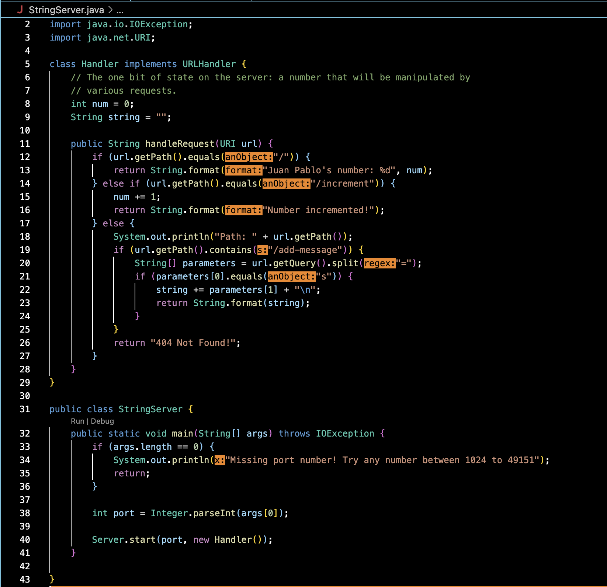
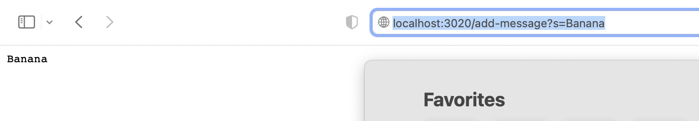
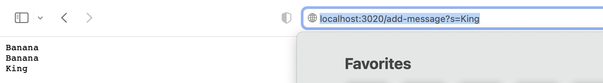

# Lab Report 2

# Part 1

The first step is to go back to the lab we did on week 2 and refresh our memories on how the ```URLHandler Inteface``` works. In our case 
we are going to use ```StringServer.java``` in a similar way to how we used ```NumberServer.java``` in the lab. ```StringServer.java``` is a program with a ```main``` method that takes a unique ```port``` as an argument, and with it, creates a ```URLHandler``` that uses ```Server.java``` to start a web server using that handler. 

The code begins by initializing two variables, an empty string, and an int at 0. The first ```if``` statement of the ```handleRequest``` method serves to track the incrementation of the int we initialized. It is irrelevant to the purpose of the lab report, but it was easier to conserve than to get rid of.

The key change in the code happens in the ```else``` statement of the ```handleRequest``` method. We are prompting the code to seek out the string ```add-message``` in the URL path to begin the process of identifying the strings we want to print out onto our web server. If ```add-message``` is present, then we create a new String array that splits the ```Query``` of the argument at the ```'='``` sign, and looks for the first element in that array to be the ```String 's'```, and if it is, then the program procedes to print out the lines at ```index [1]``` of the ```parameters``` array on a new line using ```"\n"```. Note that the values of relevant fields change as soon as we assume that a ```String``` is being provided as the argument in the query and not an ```int```. 





Once the server has been created using the main method, follow the link that should take you to the server labeled ```localhost:PORT```
Enter ```localhost:PORT/add-message?s=<string>```. I chose ```Banana``` for my string and the output is:



It is important to note what is going on in the code when we enter this command. The ```handleRequest``` method gets called, and it first checks whether the file path is equal to ```'/'``` using an ```if``` statement that calls the ```.getPath()``` and ```.equals()``` methods. Since our file path contains more than just ```'/'``` it continues on to the ```else``` statement where we prompt the code to seek out ```add-message```. If the ```add-message``` string is present, the code creates a String array called ```parameters``` which itself calls the ```getQuery``` method and ```splits``` the ```query``` at the ```'='``` sign. Then the code checks to see if ```index [0]``` of the ```parameters``` array is ```.equals()``` to the ```string 's'```, and if it is, formats and prints the contents of ```parameters[1]``` to the web server, which in this case is ```Banana```. The values of the relevant fields change according to the input on the path. For example, ```parameters[1]``` could be anything that we want to print out onto the server, but it only works if the
```String 's'``` makes up the first part of the query before the ```=``` sign. 


Now repeat the process, but with a different string, in my case I chose ```King``` and the output is: 




The second call to the ```handleRequest``` method takes the same steps as before. Once it identifies ```add-message``` in the file path, the code procedes to create the ```parameters``` array by splitting the query at the ```'='``` sign. The relevant field of ```parameters[1]``` has now become the ```string 'King'``` effectively printing out ```Banana King``` onto the server since we have retained the previous value of ```parameters[1]``` by adding it to the empty string we initialized at the beginning of the program. 

# Part 2

The code we will be working with for part 2:
```static void reverseInPlace(int[] arr) {```
    ```for(int i = 0; i < arr.length; i += 1) {```
      ```arr[i] = arr[arr.length - i - 1];```
    ```}```
  ```}```
 This method is meant to reverse the order of the integer array that is provided as a parameter, but it has a couple of bugs that aren't immediately detectable by a Junit test. 
 ```@Test```
	```public void testReverseInPlace() {```
    ```int[] input1 = { 3 };```
    ```ArrayExamples.reverseInPlace(input1);```
    ```assertArrayEquals(new int[]{ 3 }, input1);```
	```}```
  This Junit test above provides an integer array with only one element, so the test passes since reversing one element returns the same element within the array, but notice what happens when we write a test with multiple elements in an array..
  ```@Test```
	```public void testReverseInPlace2() {```
    ```int[] input1 = {1, 2, 3, 4, 5};```
    ```ArrayExamples.reverseInPlace(input1);``` 
    ```assertArrayEquals(new int[]{ 5, 4, 3, 2, 1 }, input1);```
	```}```
  This Junit test returns: ```'arrays first differed at element [3]; expected: [2] but was: [4] at ArraysTests...'```
  This shows us that there are some bugs in our program that we need to fix. 
  


