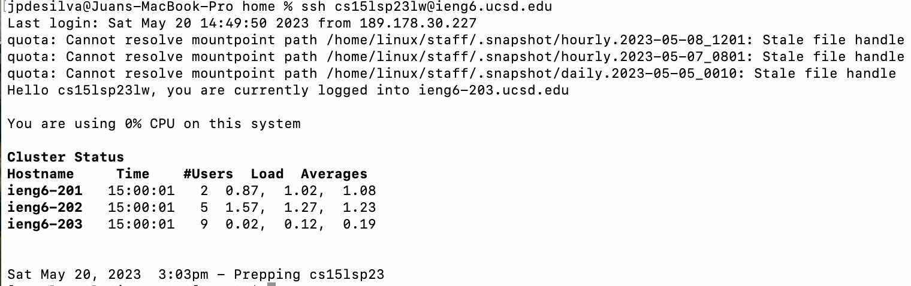
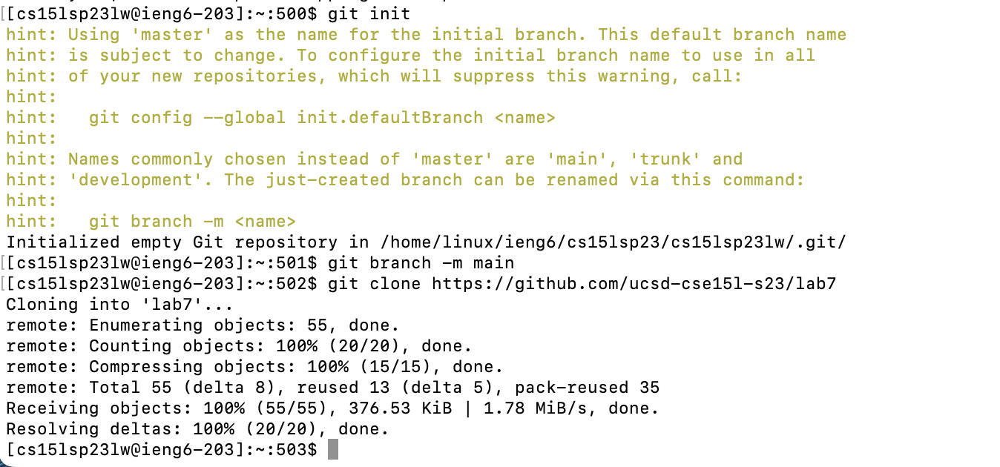

# Lab Report 4

This lab report will aim to list and explain the steps taken to create a git repository on a remote ssh server. We'll begin by 
logging in to ieng6 and forking the repository from our Github account. Then we will run the tests to demonstrate that they fail, 
and continue to fix the mistakes in the code and run the tests again to demonstrate that they now pass. Finally, we will commit 
and push our changes onto our Github account and produce an arbitrary commit message. 

# Step 1: Log into ieng6



Using the command: ```ssh cs15lsp23XX@ieng6.ucsd.edu <enter>``` log into ieng6. 

We use ```ssh``` or Secure Shell, because it provides an ecrypted connection to our client server. It is a cryptographic network that
provides us secure access to remote servers. Then we enter in our course specific account that has had a private key generated for 
fast access, and press ```<enter>```.

# Step 2: Clone fork of the repository from Github account 




