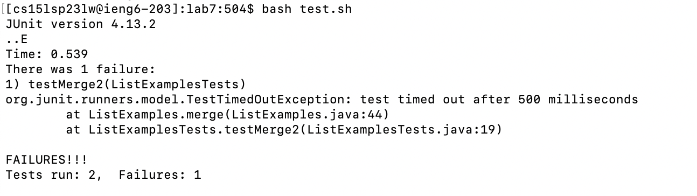

# Lab Report 4

This lab report will aim to list and explain the steps taken to create a git repository on a remote ssh server. We'll begin by 
logging in to ieng6 and forking the repository from our Github account. Then we will run the tests to demonstrate that they fail, 
and continue to fix the mistakes in the code and run the tests again to demonstrate that they now pass. Finally, we will commit 
and push our changes onto our Github account and produce an arbitrary commit message. 

# Step 1: Log into ieng6


Using the command: ```ssh cs15lsp23XX@ieng6.ucsd.edu <enter>``` log into ieng6. 

We use ```ssh``` or Secure Shell, because it provides an ecrypted connection to our client server. It is a cryptographic network that
provides us secure access to remote servers. Then we enter in our course specific account that has had a private key generated for 
fast access, and press ```<enter>```.

# Step 2: Clone fork of the repository from Github account 


Our first command is ```git init <enter>``` to initialize a new git repository to our current directory. This will display a historical message suggesting that we modify the name of our root branch, so we do: ```git branch -m main <enter>``` to take the recommendation. 

Now we are ready to clone the fork of the repository from our Github account with the command: 
```git clone https://github.com/ucsd-cse15l-s23/lab7 <enter>```
The ```git clone``` command creates a new directory with the same contents and history as the original repository. This is followed 
by the [url link](https://github.com/ucsd-cse15l-s23/lab7) to the fork of the Github repository that we want to clone. 

# Step 3: Run tests to demonstrate they fail



Our first step is to: ```cd lab7 <enter>```. The ```cd``` command serves to change the current working directory on the command line. 
We then enter ```lab7``` because that is the name of the directory that we want to work with. 

The next command is: ```bash test.sh```. This uses the bash interpreter to test a shell script. The tests demonstrably fail since 
no changes have been made to the code as of yet. 

# Step 4: Fix the code


