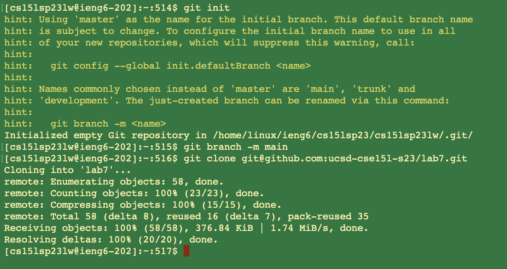
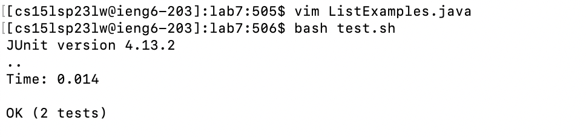
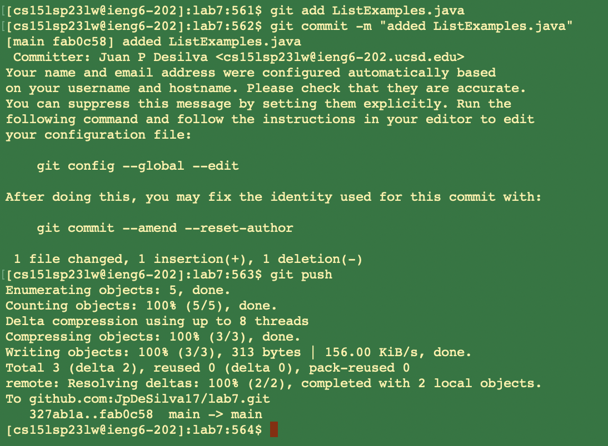

# Lab Report 4

This lab report will aim to list and explain the steps taken to create a git repository on a remote ssh server. We'll begin by 
logging in to ieng6 and forking the repository from our Github account. Then we will run the tests to demonstrate that they fail, 
and continue to fix the mistakes in the code and run the tests again to demonstrate that they now pass. Finally, we will commit 
and push our changes onto our Github account and produce an arbitrary commit message. 

# Step 1: Log into ieng6


Using the command: ```ssh cs15lsp23XX@ieng6.ucsd.edu <enter>``` log into ieng6. 

We use ```ssh``` or Secure Shell, because it provides an ecrypted connection to our client server. It is a cryptographic network that
provides us secure access to remote servers. Then we enter in our course specific account that has had a private key generated for 
fast access, and press ```<enter>```.

# Step 2: Clone fork of the repository from Github account 



Our first command is ```git init <enter>``` to initialize a new git repository to our current directory. This will display a historical message suggesting that we modify the name of our root branch, so we do: ```git branch -m main <enter>``` to take the recommendation. 

Now we are ready to clone the fork of the repository from our Github account with the command: 
```git clone https://github.com/ucsd-cse15l-s23/lab7 <enter>```
The ```git clone``` command creates a new directory with the same contents and history as the original repository. This is followed 
by the [url link](https://github.com/ucsd-cse15l-s23/lab7) to the fork of the Github repository that we want to clone. 

# Step 3: Run tests to demonstrate they fail


Our first step is to: ```cd lab7 <enter>```. The ```cd``` command serves to change the current working directory on the command line. 
We then enter ```lab7``` because that is the name of the directory that we want to work with. 

The next command is: ```bash test.sh <enter>```. This uses the bash interpreter to test a shell script. The tests demonstrably fail since 
no changes have been made to the code as of yet. 

# Step 4: Fix the code

To access ```ListExamples.java``` first enter the command ```vim ListExamples.java <enter>```. The ```vim``` command serves to access
the file that we want using the vim text editor. It is a powerful editor that allows us to enter all of our commands with our keyboard. 


Now that we have the file open, we want to access the line that we want to change with as few commands as possible. The commands I chose 
to enter were: ```44G <enter>``` on normal mode, this allows us to access line 44 on the file which is the line that we want to change.

The next command, also on the original normal mode is: ```llllll``` this allows us to traverese the line to the right. The ```l``` keybind
is used, because it is furthest to the right of the ```hjkl``` keybinds which are used to traverse in any direction in normal mode. 
This is followed by: ```i``` to access Insert mode, and ```<bs>2``` to delete the ```1``` from the ```index1``` variable to change the 
variable to ```index2```. Now that we have fixed our code we enter ```<esc>``` to leave Insert mode and go back to Normal mode. 
Finally, we use ```:wq``` to save and quit the changes we made on our file. 

# Step 5: Run tests to demonstrate they pass



Now that we are back on the command line we will use the command ```bash test.sh <enter>``` to demonstrate that our changes to the code were 
successful and that our tests on the shell script now pass on the bash interpreter. 

# Step 6: Commit and Push



Now that our changes to ```ListExamples.java``` have been completed we are ready to commit and push the changes to our Github account. 

First, we will enter the command ```git add ListExamples.java```. The ```git add``` command is used to let the system know that we want 
to include the changes we made to ```ListExamples.java``` in our next commit. 

The final step is to commit and push the changes using the command: ```git commit -m "added ListExamples.java"```, and ```git push```
The ```git commit``` command is used to commit the changes while ```-m``` is letting the system know that we plan on adding a commit message. In this case just noting that the particular commit added changes to ```ListExamples.java```. ```git push``` pushes our changes and our commits to the git repository that we forked earlier in the report. 


# Conlusion

With this step by step guide you have learned the purpose behind each specific command needed to load and edit a file on a remote server
using git repositories, as well as how to commit and push those changes onto your Github account. 


