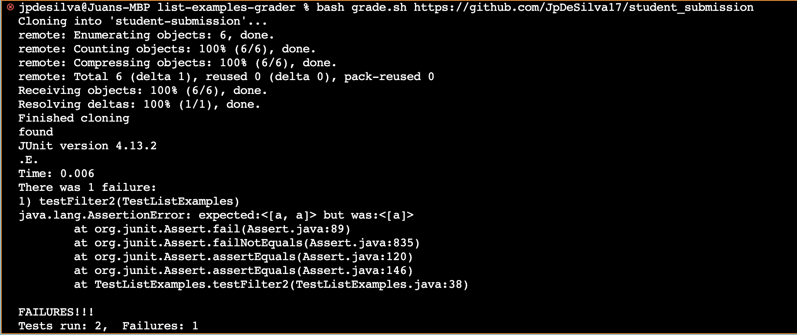
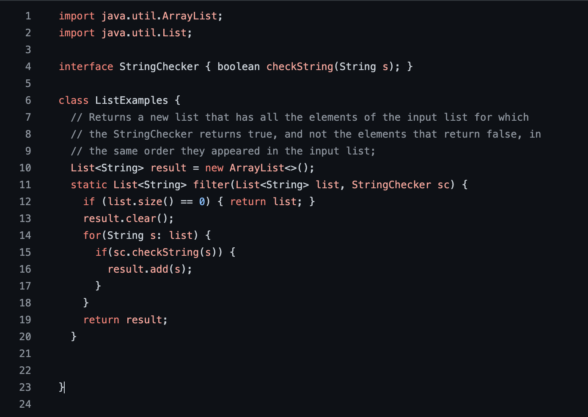
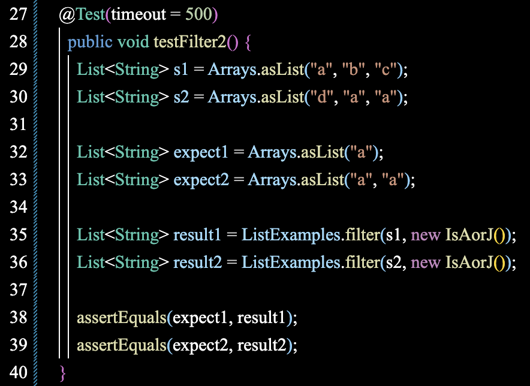

# Lab Report 5

# Part 1: Debugging Scenario

# Student's EdStem post:

**What environment are you using (computer, operating system, web browser, terminal/editor, and so on)?**

I am on a Mac using Linux, and Chrome as my browser. VS code for the editor, and GitHub to save my code. 


**Detail the symptom you're seeing. Be specific; include both what you're seeing and what you expected to see instead. 
Screenshots are great, copy-pasted terminal output is also great. Avoid saying “it doesn't work”.**

I am having trouble with a test for my filter method. The symptom given by the terminal output is an assertion error. 
My expected output was: ```<[a, a]>``` but the actual was ```<[a]>``` and I don't understand why. My best guess is there is 
something wrong with the test, and if I change some of the variables on the test around the code will work. 

Here is the symptom from the terminal:




**Detail the failure-inducing input and context. That might mean any or all of the command you're running, a test case, 
command-line arguments, working directory, even the last few commands you ran. Do your best to provide as much context as you can.**

My filter method is written in a file named ```student_submission.java```. First I create an ```ArrayList``` outside of the method named ```result``` in order to track the elements that are filtered by the ```StringChecker()``` method. I wrote ```junit``` tests to ensure that my filter method is working correcly and then ran my tests through a bash script file named ```grade.sh``` using the command:

```bash grade.sh https://github.com/JpDeSilva17/student_submission```

I am confident that the error is not a result of the bash script since the tests are being run and the file is cloned correctly, but the test ```testFilter2()``` itself fails.

This is my code: 



And this is the test that fails:  



Any input would be appreciated, thank you! 

# TA Response: 

Hello student! I am sorry to see that you are having trouble with your code!

Have you tried creating the ```ArrayList``` inside of the ```filter()``` method? It might help to draw out a memory diagram of what the code is doing to help understand why the code is behaving the way that it is. 

Your bash script does look correct. Good luck! 


