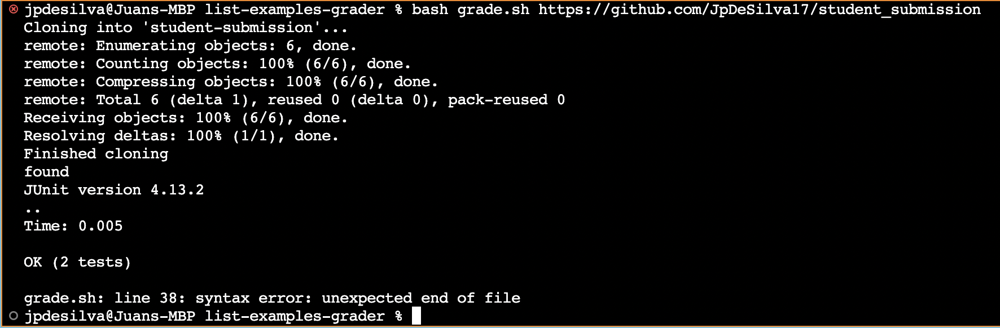

# Lab Report 5

# Part 1: Debugging Scenario

# Student's EdStem post:

**What environment are you using (computer, operating system, web browser, terminal/editor, and so on)?**

I am on a Mac using Linux, and Chrome as my browser. VS code for the editor, and GitHub to save my code. 


**Detail the symptom you're seeing. Be specific; include both what you're seeing and what you expected to see instead. 
Screenshots are great, copy-pasted terminal output is also great. Avoid saying “it doesn't work”.**

I am having trouble with a test for my filter method. The symptom given by the terminal output is an assertion error. 
My expected output was: ```<[a, a]>``` but the actual was ```<[a]>``` and I don't understand why. My best guess is there is 
something wrong with the test, and if I change some of the variables on the test around the code will work. 

Here is the symptom from the terminal:


**Detail the failure-inducing input and context. That might mean any or all of the command you're running, a test case, 
command-line arguments, working directory, even the last few commands you ran. Do your best to provide as much context as you can.**

My filter method is written in a file named ```student_submission.java```. First I create an ```ArrayList``` outside of the method named ```result``` in order to track the elements that are filtered by the ```StringChecker()``` method. I wrote ```junit``` tests to ensure that my filter method is working correcly and then ran my tests through a bash script file named ```grade.sh``` using the command:

```bash grade.sh https://github.com/JpDeSilva17/student_submission```

I am confident that the error is not a result of the bash script since the tests are being run and the file is cloned correctly, but the test ```testFilter2()``` itself fails.

This is my code: 


And this is the test that fails:  


Any input would be appreciated, thank you! 

# TA Response: 

Hello student! I am sorry to see that you are having trouble with your code!

Have you tried creating the ```ArrayList``` inside of the ```filter()``` method? 
It might help to draw out a memory diagram of what the code is doing to help understand why the code is behaving the way that it is. 

Your bash script does look to be correct. Good luck! 

# Student Response

Thank you for your response! I drew a memory diagram and realized that the ```result ArrayList``` was being used for each iteration of the method, so the behavior was off because every assertion on the ```filter()``` method carried the memory to the reference of the previous call. I decided to create the ```result ArrayList``` within the ```filter()``` method to get a fresh list for each new call to the method. This helps to avoid any collisions in behavior. 


My code now looks like this: 


And when running the tests through the bash script this is now the output: 



# Setup Information

1. The file & directory structure needed for the code was as follows. 


2. The contents of every file prior to debugging: 

(The code)


(The bash script)


(The test)


3. The full command line needed to trigger the bug: 

```bash grade.sh https://github.com/JpDeSilva17/student_submission```

4. Description of what to edit to fix the bug:

In order to fix the bug, we need to delete the ```result ArrayList``` that is created outside of the method and instead initialize it within the ```filer()``` method. This allows the memory of the code to work properly and keep adequate track of the filtered elements. 

# Part 2: Reflection

My personal favorite topic that we learned about in the second portion of the class was the section on ```Vim```. I am relatively new to coding and I didn't know there was any text editor other than VS code. I was really excited to be able to access a text editor directly from the terminal on my computer that could handle all sorts of different files. I began to work on my CSE 12 Programming Assignments on ```Vim``` to get more experience with it and I really enjoyed it. I even switched my personal journal from a Google doc to text files on ```Vim``` because of how much I enjoyed experimenting with it. Inherently, using ```Vim``` provided me with a lot of practice using the command line and have since improved my type speed and my knowledge of the commands that help me get around the command line faster. 


